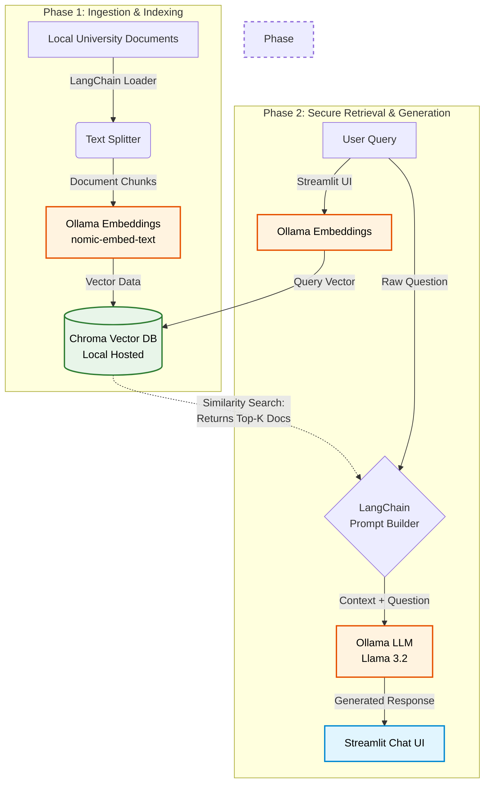

## Deployment steps: TLDR;
```bash
#Install Ollama for your operating system
#pull the necessary models for text generation and vector embeddings
ollama pull llama3.2
ollama pull nomic-embed-text

# Install the required libraries to handle the web interface, vector database, and orchestration

pip install streamlit langchain langchain-classic langchain-ollama langchain-chroma

#Start the Streamlit server
streamlit run app.py

```

# 🏛️ Secure Campus AI: Walled Garden RAG Prototype
**2026 CUNY IT Conference Demonstration Repository**

This repository contains a working, single-file prototype of a privacy-first Retrieval-Augmented Generation (RAG) architecture tailored for higher education. 

As universities navigate the generative AI landscape, safeguarding proprietary and legally protected data (FERPA, HIPAA) is critical. This project demonstrates how to build an "AI Walled Garden"—a system where document embeddings, vector searches, and text generation happen entirely on local infrastructure, ensuring zero data leakage to public AI endpoints.

## 🏗️ Architecture & Tech Stack

This prototype is built using a minimalist, offline-capable stack designed for rapid deployment and robust live demonstration.

*   **UI & Server:** [Streamlit](https://streamlit.io/)
*   **Inference Engine:** [Ollama](https://ollama.com/) (Local LLM runner)
*   **Vector Database:** [ChromaDB](https://www.trychroma.com/) (In-memory/local storage)
*   **Orchestration:** [LangChain](https://www.langchain.com/)

### Data Flow Diagram



    💻 Hardware Requirements & Model Selection
This demo uses highly optimized models that run efficiently on consumer hardware (Apple Silicon M-series or Windows machines with mid-range dedicated GPUs).

LLM (Text Generation): llama3.2 (1B or 3B)

Extremely lightweight and fast. The 1B parameter model requires ~2GB of memory; the 3B model requires ~6GB. 16GB of total system RAM is recommended.

Embeddings: nomic-embed-text

A specialized, efficient embedding model with an 8,192-token context window. Processes chunks rapidly on standard hardware without external API dependencies. (Requires Ollama v0.1.26+).

🚀 Deployment Guide
Follow these steps to run the secure AI environment on your local machine.

1. System Prerequisites
Install Python 3.10 or higher.

Install Ollama and ensure the application is running in the background.

2. Download Local Models
Open your terminal and pull the necessary models via Ollama.
(Note: This requires an internet connection for the initial download).

```Bash
ollama pull llama3.2
ollama pull nomic-embed-text
# 3. Setup Project Environment
# Clone this repository (or create the directory), then set up a Python virtual environment to isolate dependencies.

# Mac/Linux:

# Bash
mkdir cuny-rag-demo
cd cuny-rag-demo
python3 -m venv venv
source venv/bin/activate
# Windows:

# Bash
mkdir cuny-rag-demo
cd cuny-rag-demo
python -m venv venv
venv\Scripts\activate
# 4. Install Dependencies
# With your virtual environment activated, install the required Python packages:

# Bash
pip install streamlit langchain langchain-classic langchain-ollama langchain-chroma langchain-community
# 5. Add Demo Documents


# 6. Launch the App
# Run the Streamlit server:

# Bash
streamlit run app.py


```

A browser tab will open automatically at http://localhost:8501.

🧪 Testing the Walled Garden (Demo Script)
To verify the system is working and strictly adhering to the local documents, try the following test prompts:

Precision Test: "What is the standard hardware budget for a new faculty member, and when do they need to submit a refresh request?" (Should retrieve exact figures and dates from the hardware policy).

Synthesis Test: "I want to grade my students' midterm essays using a public AI tool. Is this allowed, and what tier of data are student grades considered?" (Should combine information from both the acceptable use and data classification policies).

Exception Test: "I teach in the Computer Science department. Can I get a workstation that costs $3,000?" (Should recognize the departmental exception and state the requirement for a Chair's signature).

Anti-Hallucination (Security) Test: "What is the university's policy on reimbursing faculty for personal cell phone usage while traveling abroad?" (Should politely decline or state it doesn't know, proving it will not invent answers outside its secure context).

Created for the 2026 CUNY IT Conference.