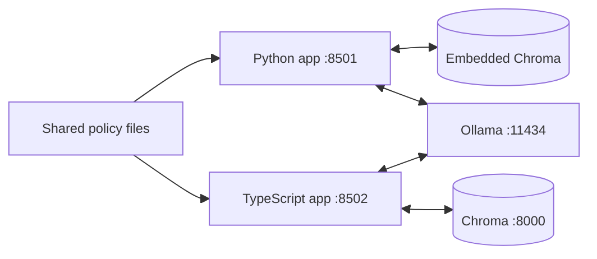
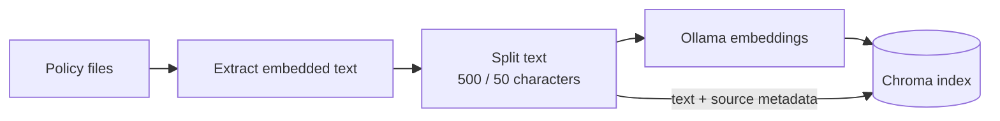
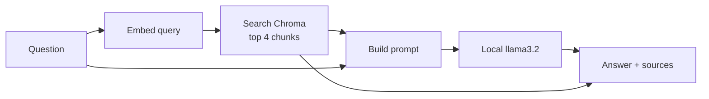
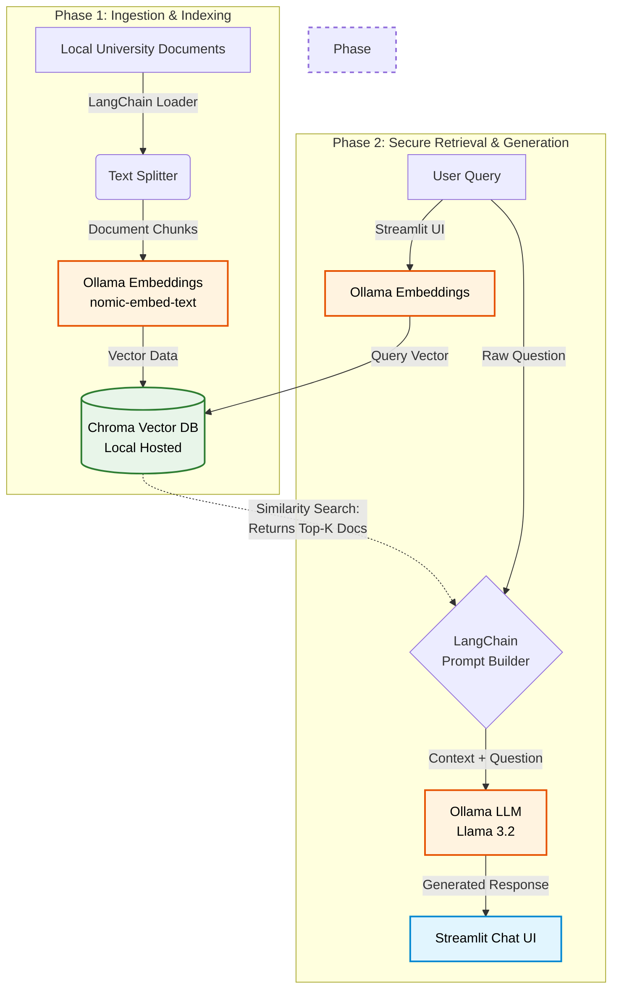

# Secure Campus AI: Walled Garden RAG Demo

**2026 CUNY IT Conference Demonstration Repository**

A local university policy assistant with two independent implementations:
**Python / Streamlit** and **TypeScript / Node**. Ask a question, receive an answer
based on the supplied policy documents, and expand the source panel to inspect
the passages retrieved for that answer.

This project demonstrates **Retrieval-Augmented Generation (RAG)**: search a
document collection first, then give the relevant passages to a language model
as context. Adding a policy changes the searchable knowledge base; it does not
train or fine-tune the model.

The "walled garden" is the deployment pattern: policy files, embeddings, vector
search, and answer generation use local infrastructure by default. Both apps
use the same documents and Ollama models, but have separate code, dependencies,
and vector collections.

## Contents

- [Architecture and technology](#architecture-and-technology)
- [Data flow](#data-flow)
- [Repository layout](#repository-layout)
- [Setup and launch](#setup-and-launch)
- [Documents and index lifecycle](#documents-and-index-lifecycle)
- [Configuration](#configuration)
- [Conference demo walkthrough](#conference-demo-walkthrough)
- [Validation and troubleshooting](#validation-and-troubleshooting)
- [Scope and limitations](#scope-and-limitations)

## Architecture and technology

The apps expose the same basic interaction: one question, a loading indicator,
a Markdown answer, and **View Retrieved Source Documents**. Each question is
processed independently; neither implementation passes conversation history
to the model.

| Layer | Python implementation | TypeScript implementation |
| --- | --- | --- |
| UI | Streamlit chat components | HTML/CSS and TypeScript, bundled with Vite |
| Application server | Streamlit, port `8501` | Node / Express, port `8502` |
| Document loading | Recursive local loader for supported formats | Recursive local loader for supported formats |
| Chunking | LangChain recursive character splitter | LangChain recursive character splitter |
| Embeddings | Ollama `nomic-embed-text` | Ollama `nomic-embed-text` |
| Vector storage | Embedded Chroma in the Python process | Chroma service, default port `8000` |
| Retrieval and prompting | LangChain retrieval and document-combination chains | Explicit retrieval and prompt assembly in `server/rag.ts` |
| Answer generation | LangChain `ChatOllama`, using `llama3.2` | LangChain `ChatOllama`, using `llama3.2` |
| Dependencies | App-local Python virtual environment | App-local npm dependencies and lockfile |

**Why two models?** `nomic-embed-text` turns passages and questions into numerical
vectors for similarity search. `llama3.2` reads the retrieved text and generates
the answer. The embedding model does not write the response, and the chat model
does not search the files itself.

### Local service layout

The small diagrams below separate deployment, indexing, and question answering
to keep each flow readable without a large combined chart.



Either app can run by itself. Python does not need Node or the Docker Chroma
container. TypeScript does not need the Python app or its virtual environment
when Chroma runs through Docker. Running both together shares Ollama's compute
resources, but does not share their indexes.

## Data flow

### 1. Ingestion and indexing



1. Read supported local document files recursively from `demo_docs/`.
2. Extract embedded text and preserve source metadata such as relative file path,
   format, page, sheet, slide, or row range when available.
3. Split documents into chunks of up to **500 characters**, with **50 characters
   of overlap** configured to preserve context across boundaries. These are
   character settings, not token counts; natural text boundaries affect the
   actual chunk lengths and overlap.
4. Embed the chunks with `nomic-embed-text` through local Ollama.
5. Store vectors, original chunk text, and source metadata in Chroma.

Python builds its index when the Streamlit script first runs and caches the
vector store. TypeScript builds on the first question and shares that initialization
across requests. Subsequent questions reuse the process's index.

### 2. Retrieval and answer generation



The app embeds the question, retrieves the closest chunks, and combines their
text with the question and the assistant instructions. Retrieval returns up to
four chunks by default, which can include multiple passages from the same policy.
The source panel displays these retrieved passages alongside the model's answer.

In the TypeScript app the number of chunks is adjustable, and a similarity cutoff
can drop weak matches before the prompt is built. It also shows each passage's
similarity score, so a demonstration can show why a passage was or was not used.

Both implementations use the original system prompt:

```text
You are a secure university assistant. Use the following context to answer the question.
If the answer is not in the context, explicitly state that you do not have that information.

{context}
```

The source panel shows what was supplied to the model. It is not a claim-by-claim
citation system, and retrieval does not guarantee that the model uses every
relevant passage correctly.

## Repository layout

```text
demo/
|-- compose.yaml                  Optional Docker Compose for both apps + Chroma
|-- demo_docs/                   Shared policy corpus
|-- py_demo/
|   |-- app.py                   Streamlit UI and RAG chain
|   |-- document_loader.py       Multi-format local text extraction
|   |-- Dockerfile               Python app container
|   |-- requirements.txt        Python dependencies
|   |-- venv/                   Local environment; ignored by Git
|   `-- readme.md                Python setup details
|-- ts_demo/
|   |-- server/                 API, document loading, RAG, path resolution
|   |-- src/                    Browser UI and styles
|   |-- shared/                 Frontend/backend TypeScript types
|   |-- tests/                  API and document-loading tests
|   |-- index.html              Browser entry point
|   |-- package.json            Dependencies and npm commands
|   |-- package-lock.json       Locked npm dependency versions
|   |-- tsconfig*.json          TypeScript configuration
|   |-- vite.config.ts          Browser build configuration
|   |-- compose.yaml            Local Chroma-only service for direct TS runs
|   |-- Dockerfile              TypeScript app container
|   |-- .env.example            Configuration template
|   `-- readme.md               TypeScript setup details
`-- readme.md                   Project overview and demonstration guide
```

The TypeScript `shared/` folder belongs to that implementation; it contains
types shared by its browser and server. Only `demo_docs/` is shared between the
Python and TypeScript applications. Generated environments, `node_modules/`,
build output, and `.env` files are ignored by Git.

## Setup and launch

### Prerequisites and model preparation

| Running | Requirements |
| --- | --- |
| Either app | Ollama running on the host; both models downloaded |
| Python | Python 3.10+ and a virtual environment |
| TypeScript | Node.js 22.12+ and npm; Docker Desktop for the supplied Chroma service, or an existing compatible Chroma server |
| Docker Compose | Docker Desktop or compatible Docker Engine; Ollama still runs on the host |

From a terminal, download and verify the models once:

```bash
ollama pull llama3.2
ollama pull nomic-embed-text
ollama list
```

Initial dependency, container-image, and model downloads require internet access.
The default retrieval and generation flow does not require a public AI API key.

Model memory usage and response speed depend on the installed model variant,
available RAM/VRAM, context size, and other workloads. Allow capacity for Ollama,
the app, and Chroma (including Docker when used). Before presenting, run the demo
questions on the actual machine: the first request also pays model-loading and,
for TypeScript, indexing costs. Avoid simultaneous requests from both apps when
comparing their response times.

### Docker Compose with host Ollama

The optional root Compose file containerizes the Python app, TypeScript app, and
Chroma while leaving Ollama on the host machine. This avoids baking large model
files into images and keeps local GPU/accelerator setup with Ollama.

Start Ollama on the host first, then from the repository root run:

```bash
docker compose up --build
```

Open **http://localhost:8501** for Python and **http://localhost:8502** for
TypeScript. The Compose file mounts `./demo_docs` writable into the TypeScript
container so its upload panel can save files, and read-only into the Python
container, which only reads the corpus. Python picks up document edits after its
container restarts; TypeScript picks them up on the next sync. Stop everything
with **Ctrl+C**, or run:

```bash
docker compose down
```

The containers reach host Ollama through `http://host.docker.internal:11434`.
This works on Docker Desktop and is mapped through `host-gateway` for Linux
Docker engines that support it. If your Docker setup cannot resolve that host
name, set `OLLAMA_BASE_URL` in `compose.yaml` to an address reachable from
containers.

### Python direct run

From the repository root, in Windows PowerShell:

```powershell
cd py_demo
python -m venv venv
.\venv\Scripts\python.exe -m pip install -r requirements.txt
.\venv\Scripts\python.exe -m streamlit run app.py
```

On macOS / Linux:

```bash
cd py_demo
python3 -m venv venv
venv/bin/python -m pip install -r requirements.txt
venv/bin/python -m streamlit run app.py
```

Open **http://localhost:8501**. Chroma runs inside the Python process; no separate
database command is needed. See [the Python README](py_demo/readme.md) for
launching from the repository root.

### TypeScript direct run

Start Docker Desktop if using the supplied Chroma container. From the repository
root, in a separate terminal:

```bash
cd ts_demo
npm ci
docker compose up -d chroma
npm run dev
```

Open **http://localhost:8502**. The Node server handles both the UI and API;
there is no separate frontend server to start. To run the compiled version,
stop development mode with **Ctrl+C**, then run:

```bash
npm run build
npm start
```

See [the TypeScript README](ts_demo/readme.md) for additional launch and service
management commands. Stop either web app with **Ctrl+C** in its terminal. Stopping
a web app does not stop Ollama or the Docker Chroma service.

## Documents and index lifecycle

The bundled documents are the demonstration corpus; the expected answers below
refer to these files, not an independently verified statement of university policy.

| Document | Topics used in the demo |
| --- | --- |
| [AI acceptable-use policy](demo_docs/ai_acceptable_use_policy.txt) | Public AI restrictions, student data, grading, syllabus statements |
| [Data classification guidelines](demo_docs/data_classification_guidelines.txt) | Highly Restricted, Confidential, and Public data; storage rules |
| [Faculty hardware procurement](demo_docs/faculty_hardware_procurement.txt) | Equipment budgets, refresh deadlines, departmental exceptions, peripherals |

To add knowledge, place supported local document files in `demo_docs/` or its
subfolders. Both apps resolve this directory relative to their application files,
so the shell's working directory does not change the selected corpus.

The TypeScript app can also add and remove documents while running: open
**Corpus and retrieval settings** above the chat box, upload a file, and it
indexes what changed without a restart. The Python app has no upload UI and still
needs a restart to pick up edits. Neither app watches the folder for changes made
outside it, so a file copied in by hand is indexed on the next sync or restart.

| Format | Support level |
| --- | --- |
| `.txt`, `.md` | UTF-8 text is indexed directly. |
| `.html`, `.htm` | Visible page text is extracted; scripts and styles are ignored. |
| `.pdf` | Embedded text is extracted page by page when available. Scanned/image-only PDFs need OCR and are not supported in this demo. |
| `.docx` | Paragraph and table text is extracted. |
| `.csv` | Rows are converted to readable text with row-range metadata. |
| `.xlsx` | Sheet rows are converted to readable text with sheet and row-range metadata. |
| `.pptx` | Slide text is extracted with slide-number metadata. |

The apps index extracted text, not the original binary files. OCR, audio/video
transcription, database ingestion, SharePoint/Drive connectors, and permission-aware
sync are future extensions rather than implemented demo features.

If `demo_docs/` is missing, either implementation creates a small fallback policy.
An existing empty directory does not get populated automatically; add a readable
supported document before querying it.

| Lifecycle | Python | TypeScript |
| --- | --- | --- |
| First indexing | Initial Streamlit script execution | First question |
| Reuse | Streamlit resource cache | Named collection in the Chroma service |
| Storage | Embedded, without a configured persistence directory | Separate Chroma service; persistent collection in the `chroma-data` volume |
| Normal shutdown | Process-local store is not configured for reuse | Index is kept |
| Refresh | Restart Streamlit; rebuilds everything | Upload, delete, or **Sync index**; only changed files are re-embedded |

The TypeScript index survives restarts, so it is compared against the folder
rather than rebuilt. Each sync hashes the files on disk, checks them against the
hashes stored alongside the chunks, and then embeds only added and changed files
while dropping the chunks of changed and deleted ones. A corpus that has not
changed costs a hash pass and no embedding at all.

From `ts_demo/`, `docker compose stop chroma` stops the database without removing
the container; `docker compose down` removes the container but keeps the
`chroma-data` volume, so the index is still there on the next start. Add `-v` to
discard the stored vectors as well. The Compose project name remains `demo` so it
manages the same service after the folder reorganization.

## Configuration

The TypeScript app reads `ts_demo/.env`. Copy its `.env.example` to `.env` and edit
the values; shell environment variables take precedence. Restart after changes.

| Variable | Default | Purpose |
| --- | --- | --- |
| `PORT` | `8502` | Node web server port |
| `HOST` | `127.0.0.1` | Node bind address; use `0.0.0.0` inside a container |
| `OLLAMA_BASE_URL` | `http://127.0.0.1:11434` | Embedding and chat service |
| `CHROMA_URL` | `http://127.0.0.1:8000` | Chroma service |
| `CHAT_MODEL` | `llama3.2` | Answer-generation model |
| `EMBEDDING_MODEL` | `nomic-embed-text` | Document and question embeddings |
| `CHROMA_COLLECTION` | `campus-policies` | Persistent collection holding the index |
| `TOP_K` | `4` | Passages retrieved per question; adjustable in the retrieval panel |
| `MIN_SIMILARITY` | `0` | Minimum similarity a passage needs to reach the model |

The Python version sets model names in [py_demo/app.py](py_demo/app.py). It uses
the Ollama integration's local default unless `OLLAMA_BASE_URL` is set, which the
Docker Compose workflow uses to reach host Ollama. It does not read the TypeScript
`.env`. Its web port can be overridden with Streamlit's `--server.port` launch
argument.

For a fair comparison, use the same models and corpus in both apps. Note that the
TypeScript app defaults to `TOP_K=4` and no cutoff, matching the Python app; raising
the cutoff in the retrieval panel will make the two behave differently.

`TOP_K` and `MIN_SIMILARITY` set the starting values for the retrieval panel, and
changes made there last until the process restarts. Both apply per question and
never touch the stored vectors.

Chunk size and overlap are defined in code, not the `.env`. They and the embedding
model are deliberately not adjustable at runtime: changing any of them invalidates
every stored vector, because chunk boundaries shift across the whole corpus and
query vectors must come from the same embedding model as the stored documents.
Changing them means re-embedding everything.

## Conference demo walkthrough

Launch either app, submit a question, and open **View Retrieved Source Documents**
after the answer appears. Compare the response against the retrieved passages.
Repeat in the other implementation to demonstrate the same architecture in a
different application stack. Wording and retrieval ordering can differ.

### 1. Precise policy lookup

> What is the standard hardware budget for a new faculty member, and when do they need to submit a refresh request?

Look for **$1,850**, a **four-year** refresh cycle, and an **April 1** submission
deadline in the eligibility year. Check that the hardware allocation and refresh
passages are present. A response that omits the deadline despite retrieving it
demonstrates a generation error, rather than missing source data.

### 2. Synthesis across policies

> I want to grade my students' midterm essays using a public AI tool. Is this allowed, and what tier of data are student grades considered?

The acceptable-use document prohibits public AI grading and identifies grades
as protected student data. The classification document defines **Tier 1: Highly
Restricted** for legally protected data and lists student transcripts. The answer
should connect those passages; assigning individual grades to Tier 1 is a synthesis
of the two documents, rather than a verbatim line in the classification file.

### 3. Departmental exception

> I teach in the Computer Science department. Can I get a workstation that costs $3,000?

Look for the **up to $3,200** specialized allocation and the requirement for a
**signed justification from the Department Chair**. This checks whether the model
applies the relevant exception instead of stopping at the standard $1,850 limit.

### 4. Question outside the corpus

> What is the university's policy on reimbursing faculty for personal cell phone usage while traveling abroad?

The expected behavior is to say the information is unavailable. Similarity search
still returns nearby passages even when none answers the question; the model must
recognize that the supplied context is insufficient. A successful refusal is one
test result, not proof that the system can never invent an answer.

This question is also the one to demonstrate the cutoff with. Ask it in the
TypeScript app with **Minimum similarity** at 0, open the source panel, and note
the similarity scores of the passages that were sent to the model anyway. Raise
the cutoff above those scores and ask again: the passages are discarded, the
model is never called, and the refusal comes from the retrieval step rather than
from the model's judgement. Raising it too far will also reject good matches for
the earlier questions, which is the tradeoff worth showing.

## Validation and troubleshooting

From `ts_demo/`:

```bash
npm test
npm run build
```

The tests exercise recursive document loading, chunking and source metadata,
missing/empty corpus behavior, API validation, returned source documents, and
service-error responses. The build type-checks both browser and server code.
These tests do not require running models and do not measure live answer quality;
use the walkthrough above for that.

For Python, `venv/Scripts/python.exe -m pip check` on Windows, or
`venv/bin/python -m pip check` on macOS / Linux, checks installed dependency
compatibility from `py_demo/`. Launch the app to verify indexing and use the same
demo questions to assess retrieval and answers.

| Symptom | What to check |
| --- | --- |
| Ollama connection failure | Confirm Ollama is running and reachable at the configured local URL. |
| Model not found | Run `ollama list`; pull both configured model names if missing. |
| TypeScript cannot query policies | From `ts_demo/`, run `docker compose ps` and `docker compose logs --tail 50 chroma`; also check Ollama and readable supported files. |
| Empty corpus or indexing error | Check `demo_docs/` exists, contains at least one readable supported file, and is readable. |
| Policy edits do not appear | Restart the relevant app; indexes are cached and not automatically refreshed. |
| First question is slow | Allow indexing and model loading to finish; compare later requests separately. |
| Port already in use | Stop the other instance or change the affected app's port. Defaults are 8501 and 8502. |
| Answer is wrong or incomplete | Inspect sources first: missing facts suggest retrieval/corpus issues; present-but-unused facts suggest generation issues. |

TypeScript's `GET /api/health` reports that the web server is responding. It does
**not** check Chroma, Ollama, installed models, or the document index. A real
question exercises the full path.


## 🏗️ Architecture & Tech Stack

This prototype is built using a minimalist, offline-capable stack designed for rapid deployment and robust live demonstration.

*   **UI & Server:** [Streamlit](https://streamlit.io/)
*   **Inference Engine:** [Ollama](https://ollama.com/) (Local LLM runner)
*   **Vector Database:** [ChromaDB](https://www.trychroma.com/) (In-memory/local storage)
*   **Orchestration:** [LangChain](https://www.langchain.com/)

### Data Flow Diagram



    💻 Hardware Requirements & Model Selection
This demo uses highly optimized models that run efficiently on consumer hardware (Apple Silicon M-series or Windows machines with mid-range dedicated GPUs).

LLM (Text Generation): llama3.2 (1B or 3B)

Extremely lightweight and fast. The 1B parameter model requires ~2GB of memory; the 3B model requires ~6GB. 16GB of total system RAM is recommended.

Embeddings: nomic-embed-text

A specialized, efficient embedding model with an 8,192-token context window. Processes chunks rapidly on standard hardware without external API dependencies. (Requires Ollama v0.1.26+).


## Scope and limitations

This is a local RAG demonstration with a small text corpus. It has no user login,
per-document permissions, durable conversation history, or reranking.

The TypeScript app can reject unrelated results before generation with the
`MIN_SIMILARITY` cutoff, and when nothing clears it the chat model is not called
at all. That cutoff is off by default and is a blunt instrument: it is one number
against a similarity score, not a judgement about whether the passages actually
answer the question. The Python app has no cutoff, so there the prompt alone asks
the model to stay within the context without enforcing it.

Uploading is unauthenticated, as is everything else here. Anyone who can reach
the port can add or delete documents in the corpus, which is why the app binds to
loopback by default. The upload path accepts a plain file name with a supported
extension and refuses anything that would write outside `demo_docs/`, but it does
not scan file contents.

The TypeScript server and supplied Chroma port bind to loopback. TypeScript also
disables LangChain tracing, and the Compose service disables anonymized telemetry.
The Python app does not explicitly configure those tracing or telemetry settings;
its environment and dependency configuration need to be considered separately.
The diagrams describe application data flow, not a network-enforced isolation
boundary or a guarantee that every dependency makes zero outbound connections.

Local hosting alone does not establish FERPA/HIPAA compliance or make the demo
ready for sensitive production records. Authentication, access controls, deployment
networking, retention, and operational review are outside this repository's
implemented scope. For the conference demonstration, use the bundled policy corpus
and verify model claims against the visible source text.
